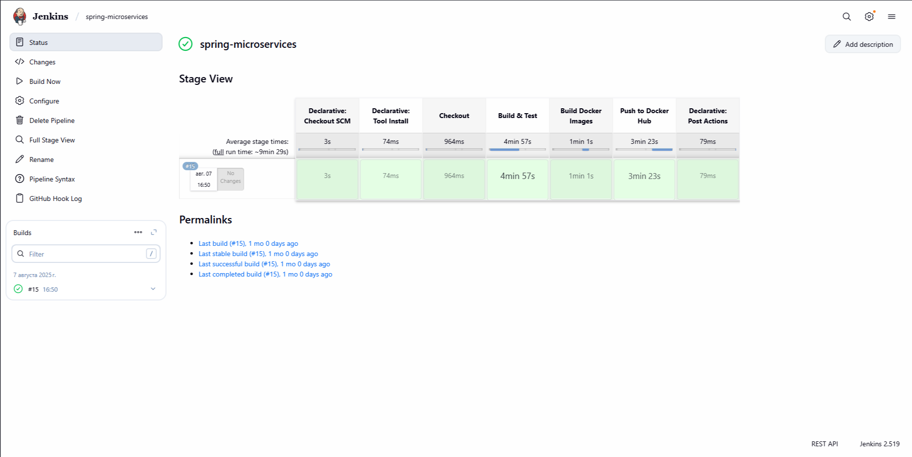

# [“Микросервисный проект магазина товаров (spring-microservices)”](https://github.com/Sergistan/spring-microservices)

## Описание

Микросервисный проект предоставляет собой RESTful API магазина товаров, доступный через Swagger и позволяющий пользователям авторизоваться, 
создать, оплатить и вернуть заказ в магазине товаров. Админу предоставляется возможность добавлять, изменять и удалять 
товары из базы данных магазина. Получать товар/товары из магазина есть возможность как и у админа, так и у обычного пользователя.

### Схема проекта:


## Список микросервисов:

- Config-server: используется для централизованного хранения и управления конфигурацией всех микросервисов. Все конфигурации микросервисов хранятся в репозитории [config-repo](https://github.com/Sergistan/config-repo);
- Eureka-server: регистрирует и хранит актуальные сведения о доступных инстансах сервисов и предоставляет их при запросе;
- Getaway-server: осуществляется единый и централизованный доступ ко всем микросервисам, а также обеспечение безопасности;
- Order-service: сервис для создания, оплаты и отмены заказа из магазина товаров;
- Shop-service: сервис из которого берется информация о возможности создания заказа при наличии товара в магазине, а также предоставляется возможность добавлять, изменять, удалять
  и получать товар/товары из базы данных магазина;
- Payment-service: сервис через который происходит оплата или возврат заказа. Также в базе данных этого сервиса хранится информация о банковском счете пользователей, которые производят оплату или возврат товара;
- History-service: сервис сохранения истории заказов (успешные, неуспешные и отмененные заказы) в nosql бд;
- Notification-service: сервис уведомления о статусе заказов (успешные, неуспешные и отмененные заказы) через электронную почту пользователя.

## Основные технологии:

- Приложение разработано с использованием Spring Boot 3 и Java 21;
- Использован сборщик пакетов Gradle;
- Использованы sql-база данных PostgreSQL и nosql-база данных MongoDB;
- Использована система управления миграциями Liquibase;
- С помощью Swagger осуществляется отправка запросов через эндпоинты приложения;
- В order-service реализованы технологии Resilience4j (CircuitBreaker и Retry) тем самым минимизируется риск каскадных отказов и автоматически обрабатываются временные сбои;
- Регистрация, аутентификация и авторизация пользователей происходит через OAuth 2.0 с помощью Keycloak;
- Использовался Redis в микросервисе shop-service для кеширования результатов запросов и снижения нагрузки на основную БД;
- Использован брокер сообщений Kafka для одновременной и асинхронной отправки сообщений на микросервисы notification-service для уведомления пользователя о состоянии заказа и history-service для сохранения состояний заказа;
- Использовалась библиотека MailSender для оповещения пользователей в notification-service;
- Взаимодействие между микросервисами order-service и shop-service, а также payment-service настроено через Feign Client;
- Для запуска используются Dockerfile и docker-compose;
- Код покрыт Unit-тестами с использованием JUnit5, Mockito для тестирования всех основных компонентов микросервисов, а также интеграционными тестами для каждого из микросервисов;
- Протестированы контроллеры с помощью WebMvcTest и репозитории с помощью DataJpaTest;
- Добавлены интеграционные тесты для тестирования работы кэша и отправки сообщений в брокер Kafka;
- Для отслеживания трассировки запросов через микросервисы настроен Zipkin;
- Для сбора и хранения метрик, а также визуализации этих метрик в микросервисах использованы Prometheus и Grafana;
- Для сбора, хранения и визуализации логов и событий в микросервисах использованы Elasticsearch, Logstash и Kibana;
- Для сборки, тестирования сервисов, создания и пуша образов этих сервисов в DockerHub в среде Jenkins используется Jenkinsfile.

## Настройка стартовых пользователей в Keycloak:
В системе зарегистрированы 2 стартовых пользователя:  

**USERNAME:** sergistan **PASSWORD:** 111 (ADMIN)

**USERNAME:** umami **PASSWORD:** 222 (USER)

### Общая настройка Keycloak:


## Order-service API и Shop-service API в Swagger:

Эндпоинты для создания, оплаты, возврата заказов и добавления, изменения, удаления и получения товара/товаров, 
а также кнопка аутентификации посредством OAuth 2.0 с помощью Keycloak представлены в Swagger.


## Основной алгоритм работы проекта:

### Создание заказа:
Клиент создает заказ для покупки товара по /order/api/v1/create и отправляет запрос:

<details>
<summary>CompositeRequest</summary>

```json
{
  "orderRequests": [
    {
      "articleId": "3873f81b-6d10-4860-97f4-0719eb88afaa",
      "quantity": 1
    }
  ],
  "addressDto": {
    "city": "Los Angeles",
    "street": "33th Avenue",
    "houseNumber": 233,
    "apartmentNumber": 112
  }
}
```
</details>

<details>
<summary>Описание полей в CompositeRequest</summary>

| Поле | Тип | Описание |
|------|-----|----------|
| `articleId` | `UUID` (string) | Идентификатор товара |
| `quantity` | `integer` | Количество товара |
| `city` | `string` | Город |
| `street` | `string` | Улица |
| `houseNumber` | `integer` | Номер дома |
| `apartmentNumber` | `integer` | Номер квартиры|
---
</details>

Затем через FeignClient OrderService обращается к ShopService, чтобы удостовериться, что такой товар по id есть в бд магазина 
и его количество в бд позволяет создать такой заказ. Если все условия соблюдены заказ создается 
(OrderService обращается к ShopService через FeignClient для подсчета итоговой стоимости заказа) возвращается 201 с ответом:

<details>
<summary>OrderDto</summary>

```json
{
  "orderUuid": "3f9edc4b-e4cf-4257-a485-72a147a0b45f",
  "totalAmount": 1000,
  "orderStatus": "WAITING_FOR_PAYMENT",
  "createdAt": "2025-01-12 13:56",
  "addressDto": {
    "city": "Los Angeles",
    "street": "33th Avenue",
    "houseNumber": 233,
    "apartmentNumber": 112
  },
  "userDto": {
    "username": "sergistan",
    "firstName": "Сергей",
    "lastName": "Уточкин",
    "email": "dzaga73i98@gmail.com"
  },
  "orderRequests": {
    "articleId": "3873f81b-6d10-4860-97f4-0719eb88afaa",
    "quantity": 1
  }
}
```
</details>

<details>
<summary>Описание полей в OrderDto</summary>

| Поле | Тип                         | Описание |
|------|-----------------------------|----------|
| `orderUuid` | `UUID` (string)             | Уникальный идентификатор заказа |
| `totalAmount` | `double`                    | Общая сумма заказа |
| `orderStatus` | `string`                    | Статус заказа (`SUCCESS`, `PENDING`, `FAILED`) |
| `createdAt` | `string (yyyy-MM-dd HH:mm)` | Дата и время создания заказа |
| `city` | `string`                    | Город доставки |
| `street` | `string`                    | Улица доставки |
| `houseNumber` | `integer`                   | Номер дома |
| `apartmentNumber` | `integer`                   | Номер квартиры (опционально) |
| `username` | `string`                    | Логин пользователя |
| `firstName` | `string`                    | Имя пользователя |
| `lastName` | `string`                    | Фамилия пользователя |
| `email` | `string`                    | Электронная почта пользователя |
| `articleId` | `UUID` (string)             | Идентификатор товара в заказе |
| `quantity` | `integer`                   | Количество товара в заказе |

</details>

После создания заказа в бд магазина уменьшается количество товара на количество указанное в заказе даже если заказ еще не оплачен, чтобы не было проблем с одновременным созданием заказов с одинаковыми товарами разными пользователями.

### Оплата заказа:
Оплата заказа осуществляется по /order/api/v1/pay и отправляется запрос через FeignClient на PaymentService:

<details>
<summary>PaymentRequest</summary>

```json
{
  "orderUuid": "3f9edc4b-e4cf-4257-a485-72a147a0b45f",
  "cardNumber": "5078 6038 0721 8893"
}
```
</details>

<details>
<summary>Описание полей в PaymentRequest</summary>

| Поле | Тип | Описание                                 |
|------|-----|------------------------------------------|
| `orderUuid` | `UUID` (string) | Уникальный идентификатор заказа          |
| `cardNumber` | `string` | Номер банковской карты для оплаты заказа |
---
</details>

В случае ввода корректной банковской карты и при условии необходимого количества денег на ней для оплаты заказа возвращается 200 
с ответом:

<details>
<summary>PaymentRequest</summary>

```json
{
  "paymentId": "3f9edc4b-e4cf-4257-a485-72a147a0b45f",
  "status": "SUCCESS"
}
```
</details>

<details>
<summary>Описание полей в PaymentRequest</summary>

| Поле | Тип | Описание                                 |
|------|-----|------------------------------------------|
| `paymentId` | `UUID` (string) | Уникальный идентификатор оплаты заказа   |
| `status` | `string` | Статус заказа (`SUCCESS`, `PENDING`, `FAILED`) |
---
</details>

Если денег на счету банковской карты недостаточно для оплаты заказа, то статус меняется на FAILED.
В любом случае если оплата прошла или не прошла - OrderDtoForKafka отправляется в очередь kafka для HistoryService и NotificationService:
<details>
<summary>OrderDtoForKafka</summary>

```json
{
  "orderUuid": "3f9edc4b-e4cf-4257-a485-72a147a0b45f",
  "totalAmount": 1000,
  "orderStatus": "SUCCESS",
  "createdAt": "2025-01-12 13:56",
  "updatedAt": "2025-01-12 13:57",
  "addressDto": {
    "city": "Los Angeles",
    "street": "33th Avenue",
    "houseNumber": 233,
    "apartmentNumber": 112
  },
  "userDto": {
    "username": "sergistan",
    "firstName": "Сергей",
    "lastName": "Уточкин",
    "email": "dzaga73i98@gmail.com"
  },
  "orderRequests": {
    "articleId": "3873f81b-6d10-4860-97f4-0719eb88afaa",
    "quantity": 1
  },
  "paymentId" : "3f9edc4b-e4cf-4257-a485-72a147a0b45f"
}
```
</details>

<details>
<summary>Описание полей в OrderDto</summary>

| Поле | Тип                         | Описание                                       |
|------|-----------------------------|------------------------------------------------|
| `orderUuid` | `UUID` (string)             | Уникальный идентификатор заказа                |
| `totalAmount` | `double`                    | Общая сумма заказа                             |
| `orderStatus` | `string`                    | Статус заказа (`SUCCESS`, `PENDING`, `FAILED`) |
| `createdAt` | `string (yyyy-MM-dd HH:mm)` | Дата и время создания заказа                   |
| `updatedAt` | `string (yyyy-MM-dd HH:mm)` | Дата и время обновления заказа                 |
| `city` | `string`                    | Город доставки                                 |
| `street` | `string`                    | Улица доставки                                 |
| `houseNumber` | `integer`                   | Номер дома                                     |
| `apartmentNumber` | `integer`                   | Номер квартиры (опционально)                   |
| `username` | `string`                    | Логин пользователя                             |
| `firstName` | `string`                    | Имя пользователя                               |
| `lastName` | `string`                    | Фамилия пользователя                           |
| `email` | `string`                    | Электронная почта пользователя                 |
| `articleId` | `UUID` (string)             | Идентификатор товара в заказе                  |
| `quantity` | `integer`                   | Количество товара в заказе                     |
| `paymentId` | `UUID` (string)             | Уникальный идентификатор оплаты заказа         |

</details>

### Отмена заказа:
Заказ можно отменить лишь при условии, что он был до этого успешно оплачен. Отмена заказа осуществляется по /order/api/v1/refunded и отправляется запрос через FeignClient на PaymentService:

<details>
<summary>PaymentRequest</summary>

```json
{
  "orderUuid": "3f9edc4b-e4cf-4257-a485-72a147a0b45f",
  "cardNumber": "5078 6038 0721 8893"
}
```
</details>

<details>
<summary>Описание полей в PaymentRequest</summary>

| Поле | Тип | Описание                                                        |
|------|-----|-----------------------------------------------------------------|
| `orderUuid` | `UUID` (string) | Уникальный идентификатор заказа                                 |
| `cardNumber` | `string` | Номер банковской карты для возврата средств после отмены заказа |
---
</details>

В случае ввода корректной банковской карты возвращается 200 с ответом "Заказ успешно отменен". Статус в заказе меняется на REFUNDED 
и OrderDtoForKafka отправляется в очередь kafka для HistoryService и NotificationService с измененными данными.

После отмены заказа в бд магазина увеличивается количество товара на количество указанное в возвращенном заказе, а сумма средств потраченных на оплату заказа возвращается на указанную карту.

Операции по проверке, созданию, оплаты и возврата заказа выполнены с технологиями CircuitBreaker и Retry для повышения отказоустойчивости системы.

### Создание, изменение, удаление и получение товара/товаров в ShopService.
Создание, изменение, удаление и получение товара/товаров в ShopService реализованы классическими CRUD операциями. 
Единственное ограничение заключается в том, что создание, изменение и удаление товаров в магазине может осуществлять только админ.
Также над CRUD операциями установлено кэширование через Redis для повышения производительности системы.
Эндпоинт на получение всех товаров в магазине создан с применением возможности сортировки, ограничения выдачи постранично с указанием нужного размера страницы.

### NotificationService и HistoryService
Все заказы (успешные, неуспешные и отмененные) через kafka в формате OrderDtoForKafka отправляется одновременно в NotificationService и HistoryService.
В NotificationService с помощью JavaMailSender происходит отправка сообщений о статусе заказов через электронную почту пользователя.


В HistoryService происходит сохранение истории заказов (успешные, неуспешные и отмененные заказы) в MongoDB.


## Инструменты для просмотра метрик, логов и трассеров в проекте:

ELK - система для сбора, хранения и мониторинга логов в системе.


Prometheus и Grafana - для сбора и визуализации метрик.


Zipkin - для сбора и визуализации трассировки между микросервисами.


## CI/CD

CI/CD реализован в среде Jenkins для сборки, тестирования сервисов, создания и пуша образов этих сервисов в DockerHub. 

